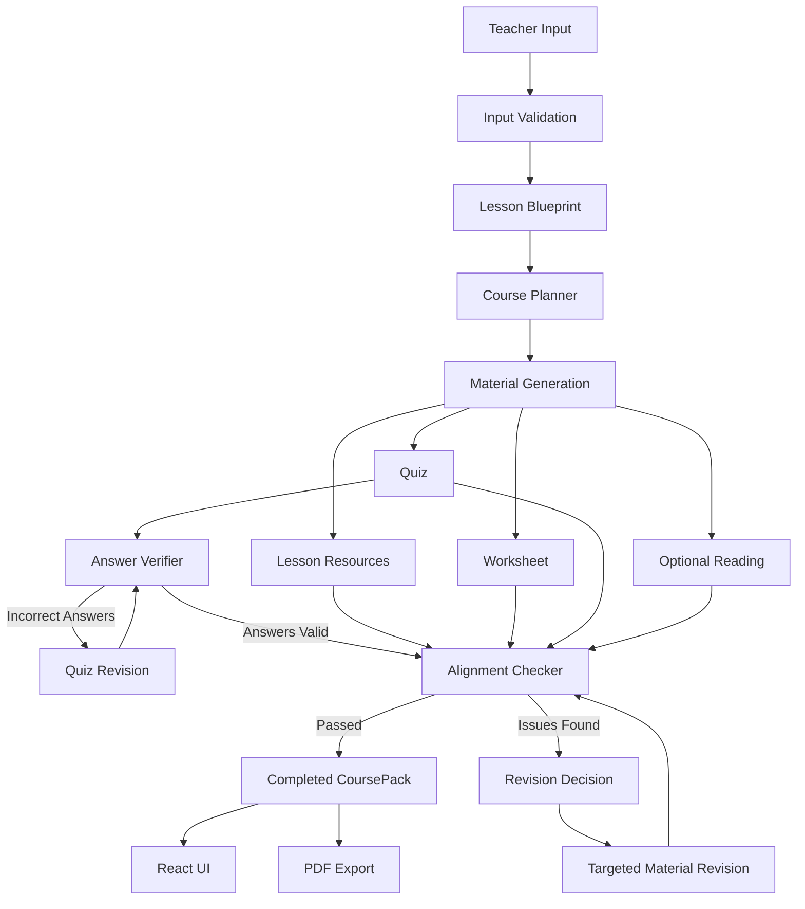
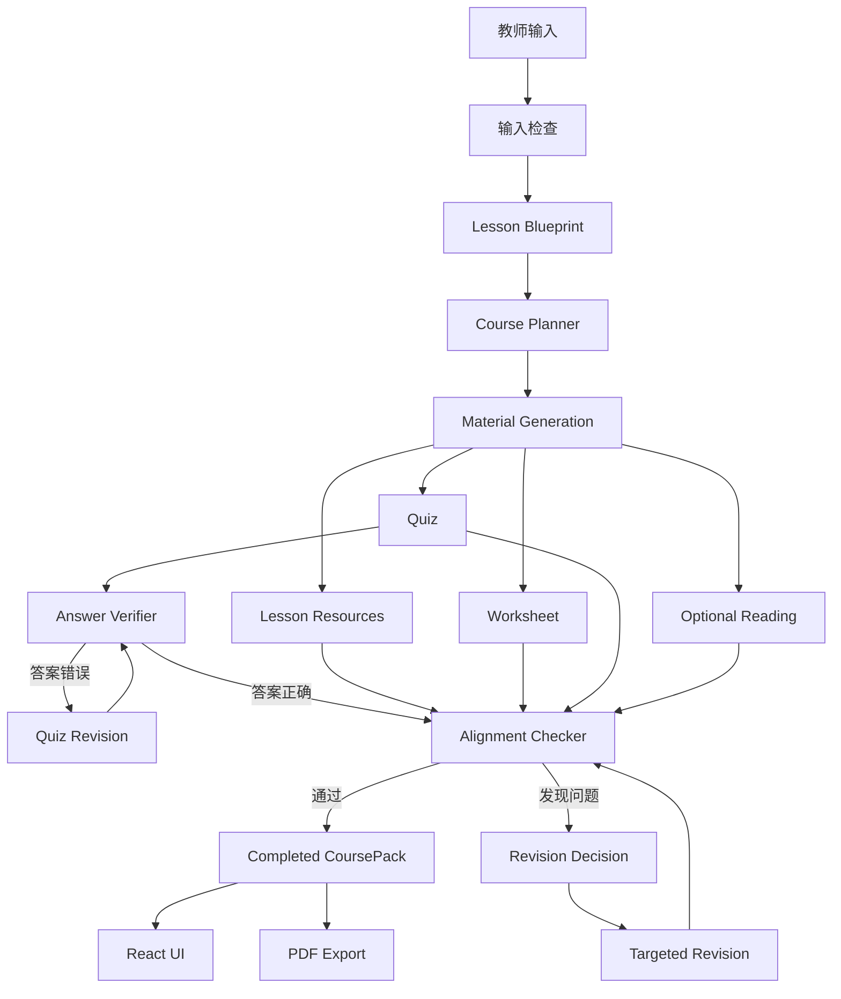

# CoursePack

**Languages:** [English](#coursepack) | [中文](#中文版)

CoursePack is an AI-powered lesson planning system that generates a coherent, teacher-ready instructional package from a single lesson objective.

Instead of generating disconnected worksheets, quizzes, and lesson materials independently, CoursePack first creates a shared **Lesson Blueprint** and uses it as the source of truth for all downstream materials.

The system then verifies quiz answers, checks alignment across generated materials, and automatically revises specific components when problems are detected.

## Live Demo

**CoursePack:**  
https://course-pack-kohl.vercel.app

> The backend is hosted on a free Render instance, so the first request after a period of inactivity may take a little longer while the server wakes up.

---

## Why CoursePack?

Generative AI can quickly create instructional materials, but independently generated materials often have problems such as:

- quizzes assessing concepts that were never taught
- worksheets practicing skills outside the lesson scope
- activities that do not match the lesson sequence
- incorrect quiz answer keys
- unrealistic lesson timing
- inconsistent terminology across materials
- disconnected readings, worksheets, and assessments

CoursePack addresses this by using a shared lesson representation and a multi-stage generation, verification, and revision workflow.

Rather than treating each material as an independent prompt, the system treats the lesson as a connected instructional package.

---

## Features

### Lesson Blueprint

CoursePack converts the teacher's input into a structured lesson blueprint containing:

- grade level
- subject
- lesson objective
- class length
- core concepts
- prerequisites
- vocabulary
- lesson sequence
- assessment targets

The blueprint becomes the shared source of truth for later generation.

### AI Course Planner

A planning step determines which instructional materials are appropriate for the lesson.

Possible materials include:

- lesson resources
- worksheet
- quiz
- optional reading

This allows CoursePack to generate materials based on instructional need rather than always producing the same fixed package.

### Lesson Resources

Resources are generated directly from the lesson sequence.

Each lesson step preserves its:

- activity
- order
- timing

Resources are designed to support the activity rather than introduce unrelated lesson stages.

### Worksheet Generation

Worksheets are generated from the lesson concepts and assessment targets so practice remains within the intended lesson scope.

### Quiz Generation

Teachers can choose the number of quiz questions.

Quiz questions are generated from the shared blueprint rather than from an independent prompt.

### Quiz Answer Verification

After a quiz is generated, a separate verifier independently checks the proposed answers.

If an answer is determined to be incorrect, CoursePack can revise the quiz before continuing.

### Cross-Material Alignment Checking

CoursePack evaluates the generated package for instructional alignment.

The checker examines areas such as:

- blueprint scope
- taught → practiced → assessed progression
- concept coverage
- lesson sequence consistency
- worksheet and quiz alignment
- semantic consistency
- lesson time feasibility
- source integrity

The checker focuses on evidence available inside the generated lesson package rather than performing external fact-checking.

### Targeted Revision Loop

When an alignment issue is found, CoursePack identifies the affected material and revises only the necessary component.

For example:

```text
Alignment issue detected
        ↓
Determine affected material
        ↓
Revise quiz / worksheet / reading / lesson resources
        ↓
Run validation again
```

Revision attempts are bounded so the workflow cannot loop indefinitely.

### PDF Export

Teachers can export the completed CoursePack as a teacher-ready PDF containing available materials such as:

- Lesson Blueprint
- Lesson Resources
- Worksheet
- Worksheet Answer Key
- Quiz
- Quiz Answers
- Reading Material

---

## System Architecture



---

## Workflow

The backend workflow is implemented as a LangGraph state machine.

```text
START
  ↓
Planner
  ↓
Generate Materials
  ↓
Quiz Answer Verification
  ↓
Cross-Material Alignment Check
  ↓
┌─────────────────────────────┐
│ Alignment Passed?           │
│                             │
│ Yes → Finish                │
│ No  → Revision Decision     │
└─────────────────────────────┘
                ↓
        Targeted Revision
                ↓
        Alignment Check Again
                ↓
               END
```

This architecture separates **generation**, **verification**, and **revision** into distinct responsibilities.

---

## Design Principles

### One Shared Blueprint

Every generated material is grounded in the same structured lesson blueprint.

This helps reduce contradictions between lesson instruction, student practice, and assessment.

### Structured LLM Outputs

LLM responses are parsed into Pydantic models instead of being passed through as unrestricted text.

This provides predictable structures for downstream processing.

### Separate Verification Responsibilities

CoursePack does not rely on a single "judge" prompt.

Different components have different responsibilities:

- **Answer Verifier** — checks quiz answer correctness
- **Alignment Checker** — checks lesson-wide instructional consistency
- **Revision Decision** — determines which material should be changed
- **Reviser** — modifies the affected material

### Targeted Revision

CoursePack avoids regenerating the entire lesson package whenever one component has a problem.

Only the affected material is revised whenever possible.

### Bounded Agent Loops

Verification and revision loops have retry limits to prevent uncontrolled agent execution.

---

## Example

A teacher might enter:

```text
Grade: 7
Subject: Math
Objective: Students will solve two-step equations.
Class Length: 55 minutes
Quiz Questions: 5
```

CoursePack can produce:

```text
Lesson Blueprint
│
├── Concepts
├── Vocabulary
├── Prerequisites
├── Lesson Sequence
└── Assessment Targets

Lesson Resources
│
├── Warm-up support
├── Direct instruction support
├── Worked examples
├── Guided practice
└── Exit activity

Worksheet
│
├── Practice problems
└── Answer key

Quiz
│
├── Assessment questions
└── Verified answers

Optional Reading
```

Before returning the package, CoursePack evaluates whether those materials remain consistent with the original lesson objective and with one another.

---

## Tech Stack

### Backend

- Python
- FastAPI
- Pydantic
- LangGraph
- OpenAI-compatible API client
- DeepSeek
- ReportLab

### Frontend

- React
- Vite
- JavaScript
- CSS

### Deployment

- Vercel — frontend
- Render — FastAPI backend
- GitHub — source control

---

## Project Structure

```text
CoursePack/
├── app/
│   ├── alignment_checker.py
│   ├── answer_verifier.py
│   ├── api.py
│   ├── blueprint.py
│   ├── graph.py
│   ├── input_validator.py
│   ├── material_selector.py
│   ├── models.py
│   ├── pdf_export.py
│   ├── planner.py
│   ├── quiz.py
│   ├── reading.py
│   ├── resources.py
│   ├── reviser.py
│   ├── revision_decider.py
│   ├── utils.py
│   ├── workflow.py
│   └── worksheet.py
│
├── frontend/
│   ├── src/
│   │   ├── App.jsx
│   │   ├── App.css
│   │   └── ...
│   └── package.json
│
├── requirements.txt
└── README.md
```

---

## Running CoursePack Locally

### 1. Clone the repository

```bash
git clone https://github.com/yuehanhu0527-pixel/CoursePack.git
cd CoursePack
```

### 2. Create a Python virtual environment

```bash
python3 -m venv .venv
source .venv/bin/activate
```

### 3. Install backend dependencies

```bash
pip install -r requirements.txt
```

### 4. Configure the backend environment

Create a `.env` file in the project root:

```text
DEEPSEEK_API_KEY=your_api_key_here
```

Do not commit this file to GitHub.

### 5. Start the FastAPI backend

```bash
python -m uvicorn app.api:app --reload
```

The backend will run at:

```text
http://127.0.0.1:8000
```

FastAPI documentation:

```text
http://127.0.0.1:8000/docs
```

### 6. Install frontend dependencies

Open another terminal:

```bash
cd frontend
npm install
```

### 7. Configure the frontend

Create:

```text
frontend/.env
```

with:

```text
VITE_API_BASE_URL=http://127.0.0.1:8000
```

### 8. Start the React frontend

```bash
npm run dev -- --port 5173
```

Open:

```text
http://localhost:5173
```

---

## Validation Testing

CoursePack has been tested across lesson types from multiple subjects to identify different classes of alignment problems.

Examples include:

| Subject | Example Lesson | Issues Evaluated |
|---|---|---|
| Math | Two-step equations | assessment scope and concept alignment |
| Science | Ecosystem species decrease | direct vs. indirect effects and time feasibility |
| ELA | Theme using textual evidence | task-level alignment and lesson timing |
| Social Studies | Primary-source lesson | source integrity and evidence requirements |
| Music | Tempo, dynamics, and mood | semantic alignment across lesson materials |

These tests were used to refine the validation prompts and reduce unnecessary alignment warnings.

---

## Current Limitations

CoursePack is currently a prototype and still has several limitations.

- Generated materials depend on LLM quality.
- The alignment checker evaluates internal package consistency but does not perform authoritative external fact-checking.
- Source verification is intentionally conservative.
- Very short lesson durations may not provide enough time for all requested materials.
- The current system does not yet retrieve official curriculum standards automatically.
- Generated instructional materials should still be reviewed by a teacher before classroom use.
- The free hosted backend may have a cold-start delay after inactivity.

---

## Future Work

Potential future improvements include:

- curriculum-standard retrieval and grounding
- optional RAG-based instructional resources
- improved material-selection logic
- teacher editing before export
- differentiated materials for multiple learner levels
- saved lesson history
- DOCX export
- richer lesson-resource formatting
- automated regression testing
- improved observability for agent decisions

---

## Project Goal

CoursePack was built to explore how agentic AI systems can move beyond single-prompt content generation.

The project focuses on using:

- structured intermediate representations
- planning
- specialized verification
- cross-document consistency checking
- targeted revision
- bounded agent loops

to create a more coherent instructional package.

---

## Author

**Yuehan Hu**

Built as an AI engineering and information systems project.

---

# 中文版

## CoursePack 是什么？

CoursePack 是一个 AI 驱动的教学材料生成系统。

教师只需要输入：

- 年级
- 学科
- 教学目标
- 课堂时长
- Quiz 题目数量

CoursePack 就会生成一个结构化、彼此一致的教学包，包括：

- Lesson Blueprint（课程蓝图）
- Lesson Resources（课堂资源）
- Worksheet（练习单）
- Quiz（测验）
- 可选 Reading Material（阅读材料）
- PDF 导出

与普通的“一次性生成内容”不同，CoursePack 不会分别独立生成 Quiz、Worksheet 和 Resources。

系统首先创建一个统一的 **Lesson Blueprint**，后续所有教学材料都以这个 Blueprint 为共同依据。

这样可以减少不同材料之间内容不一致的问题。

---

## 在线演示

**CoursePack Live Demo：**

https://course-pack-kohl.vercel.app

> 后端部署在 Render 免费实例上。如果长时间没有访问，服务器可能会休眠，因此第一次请求可能需要稍等一会儿。

---

## 为什么做 CoursePack？

生成式 AI 可以非常快地创建教学材料，但如果每一种材料都是单独生成的，就很容易出现一些问题，例如：

- Quiz 考了课堂上没有教过的内容
- Worksheet 出现超出教学范围的题目
- Lesson Resources 和 Lesson Sequence 对不上
- Quiz 的答案本身错误
- 课堂活动时间安排不现实
- 不同材料使用了不一致的概念或术语
- Reading、Worksheet、Quiz 彼此脱节

CoursePack 希望解决的核心问题就是：

**如何让 AI 生成的多个教学材料彼此协调，而不是各自独立。**

---

## 核心功能

### Lesson Blueprint

CoursePack 会先把教师输入转化成结构化的课程蓝图。

Blueprint 包括：

- grade
- subject
- objective
- class length
- concepts
- prerequisites
- vocabulary
- lesson sequence
- assessment targets

之后所有材料都会基于这个 Blueprint 生成。

### AI Course Planner

系统不会固定生成所有材料。

Planner 会根据当前课程内容决定需要生成哪些材料，例如：

- Lesson Resources
- Worksheet
- Quiz
- Optional Reading

这样可以让系统根据实际教学需求选择材料。

### Lesson Resources

Lesson Resources 会严格基于 Lesson Sequence 生成。

每个课堂步骤都会尽量保持：

- 相同顺序
- 相同 activity
- 相同时间安排

Resources 的作用是支持已有的 lesson step，而不是随意增加新的教学阶段。

### Worksheet Generation

Worksheet 根据：

- Lesson Blueprint
- Concepts
- Assessment Targets

生成练习内容。

目标是让学生练习的内容和课堂所教内容保持一致。

### Quiz Generation

教师可以选择 Quiz 题目数量。

Quiz 同样基于 Lesson Blueprint 生成，而不是单独使用一个不相关的 prompt。

### Quiz Answer Verification

Quiz 生成之后，系统不会直接默认答案一定正确。

一个独立的 Answer Verifier 会重新检查每一道题的答案。

如果发现答案错误，系统会进入 revision 流程，对 Quiz 进行修改。

### Cross-Material Alignment Checking

CoursePack 会进一步检查整个教学包内部是否一致。

Alignment Checker 会检查：

- 是否超出 Blueprint 范围
- taught → practiced → assessed 是否连贯
- 概念是否真正被覆盖
- Lesson Resources 是否和 Lesson Sequence 对齐
- Worksheet 和 Quiz 是否符合教学目标
- 语义是否一致
- 时间安排是否合理
- Source Integrity 是否存在问题

Alignment Checker 主要检查的是 **CoursePack 内部已有内容之间的一致性**，而不是依赖模型自身知识进行外部事实核查。

### Targeted Revision Loop

如果系统发现问题，不会每次把整个 CoursePack 全部重新生成。

它会先判断：

**到底是哪一个材料出了问题？**

然后只修改对应材料，例如：

```text
发现 Alignment Issue
        ↓
判断受影响的材料
        ↓
修改 Quiz / Worksheet / Reading / Lesson Resources
        ↓
重新进行 Alignment Check
```

这样可以减少不必要的重新生成。

### PDF Export

用户可以把最终结果导出成 PDF。

PDF 中可以包含：

- Lesson Blueprint
- Lesson Resources
- Worksheet
- Worksheet Answer Key
- Quiz
- Quiz Answers
- Reading Material

---

## 系统架构



---

## 工作流程

CoursePack 后端使用 LangGraph 构建状态机。

```text
START
  ↓
Planner
  ↓
Generate Materials
  ↓
Quiz Answer Verification
  ↓
Cross-Material Alignment Check
  ↓
Alignment Passed?
  ├── Yes → Finish
  └── No
       ↓
Revision Decision
       ↓
Targeted Revision
       ↓
Alignment Check Again
       ↓
END
```

这个结构把：

- Generation
- Verification
- Revision

拆成了不同的职责。

---

## 设计原则

### 一个共享 Blueprint

所有教学材料都来自同一个 Blueprint。

这样可以降低 Quiz、Worksheet、Resources 之间出现冲突的概率。

### Structured LLM Output

LLM 输出会被解析为 Pydantic Model，而不是直接把自由文本作为系统内部数据。

这样可以让后续 workflow 更稳定。

### Verification 职责分离

不同模块负责不同问题：

- **Answer Verifier**：检查 Quiz 答案是否正确
- **Alignment Checker**：检查整个教学包是否一致
- **Revision Decision**：判断应该修改哪个材料
- **Reviser**：真正执行修改

### Targeted Revision

如果只是 Worksheet 有问题，就尽量只改 Worksheet。

如果只是 Quiz 有问题，就尽量只改 Quiz。

避免重新生成整个教学包。

### Bounded Revision

Revision loop 有最大重试次数。

这样可以避免 agent 无限循环。

---

## 示例

例如教师输入：

```text
Grade: 7
Subject: Math
Objective: Students will solve two-step equations.
Class Length: 55 minutes
Quiz Questions: 5
```

CoursePack 可以生成：

```text
Lesson Blueprint
│
├── Concepts
├── Vocabulary
├── Prerequisites
├── Lesson Sequence
└── Assessment Targets

Lesson Resources
│
├── Warm-up support
├── Direct instruction support
├── Worked examples
├── Guided practice
└── Exit activity

Worksheet
│
├── Practice problems
└── Answer key

Quiz
│
├── Assessment questions
└── Verified answers

Optional Reading
```

系统在返回结果之前，还会检查这些材料是否和原始教学目标以及彼此之间保持一致。

---

## 技术栈

### Backend

- Python
- FastAPI
- Pydantic
- LangGraph
- OpenAI-compatible API client
- DeepSeek
- ReportLab

### Frontend

- React
- Vite
- JavaScript
- CSS

### Deployment

- Vercel — 前端
- Render — FastAPI 后端
- GitHub — 版本管理

---

## 项目结构

```text
CoursePack/
├── app/
│   ├── alignment_checker.py
│   ├── answer_verifier.py
│   ├── api.py
│   ├── blueprint.py
│   ├── graph.py
│   ├── input_validator.py
│   ├── material_selector.py
│   ├── models.py
│   ├── pdf_export.py
│   ├── planner.py
│   ├── quiz.py
│   ├── reading.py
│   ├── resources.py
│   ├── reviser.py
│   ├── revision_decider.py
│   ├── utils.py
│   ├── workflow.py
│   └── worksheet.py
│
├── frontend/
│   ├── src/
│   │   ├── App.jsx
│   │   ├── App.css
│   │   └── ...
│   └── package.json
│
├── requirements.txt
└── README.md
```

---

## 本地运行

### 1. Clone 项目

```bash
git clone https://github.com/yuehanhu0527-pixel/CoursePack.git
cd CoursePack
```

### 2. 创建 Python virtual environment

```bash
python3 -m venv .venv
source .venv/bin/activate
```

### 3. 安装后端依赖

```bash
pip install -r requirements.txt
```

### 4. 配置后端环境变量

在项目根目录创建：

```text
.env
```

写入：

```text
DEEPSEEK_API_KEY=your_api_key_here
```

不要把这个文件提交到 GitHub。

### 5. 启动 FastAPI

```bash
python -m uvicorn app.api:app --reload
```

Backend：

```text
http://127.0.0.1:8000
```

API Docs：

```text
http://127.0.0.1:8000/docs
```

### 6. 安装前端依赖

打开另一个 Terminal：

```bash
cd frontend
npm install
```

### 7. 配置前端环境变量

创建：

```text
frontend/.env
```

写入：

```text
VITE_API_BASE_URL=http://127.0.0.1:8000
```

### 8. 启动前端

```bash
npm run dev -- --port 5173
```

打开：

```text
http://localhost:5173
```

---

## 测试

CoursePack 使用多个不同学科的 lesson 进行回归测试，包括：

| 学科 | 示例 Lesson | 主要测试问题 |
|---|---|---|
| Math | Two-step equations | Assessment scope、concept alignment |
| Science | Ecosystem species decrease | Direct / indirect effects、time feasibility |
| ELA | Theme using textual evidence | Task-level alignment、lesson timing |
| Social Studies | Primary-source lesson | Source integrity、evidence requirements |
| Music | Tempo, dynamics, and mood | Cross-material semantic alignment |

这些测试主要用于持续改进 Alignment Checker，并减少不必要的 false positive。

---

## 当前限制

CoursePack 目前仍然是一个 prototype，因此存在一些限制：

- 生成内容仍然依赖 LLM 的质量
- Alignment Checker 主要检查内部一致性，而不是权威外部事实核查
- Source verification 采用比较保守的策略
- 课堂时间过短时，可能无法合理容纳所有生成材料
- 当前还没有自动检索官方 curriculum standards
- AI 生成的教学材料在真实课堂使用前仍应由教师审核
- 免费 Render 后端可能存在 cold start 延迟

---

## Future Work

未来可能加入：

- Curriculum standards retrieval
- RAG-based instructional resources
- 更完善的 material-selection logic
- 教师在线修改生成材料
- Differentiated instruction
- Lesson history
- DOCX export
- 更丰富的 Lesson Resources formatting
- Automated regression testing
- Agent observability

---

## 项目目标

CoursePack 的重点不是单纯让 LLM “生成更多内容”。

这个项目主要探索如何通过：

- structured intermediate representation
- planning
- specialized verification
- cross-document consistency checking
- targeted revision
- bounded agent loops

让一个 AI 系统生成更加连贯、可验证、可修改的教学材料包。

---

## 作者

**Yuehan Hu**

AI Engineering / Information Systems Project